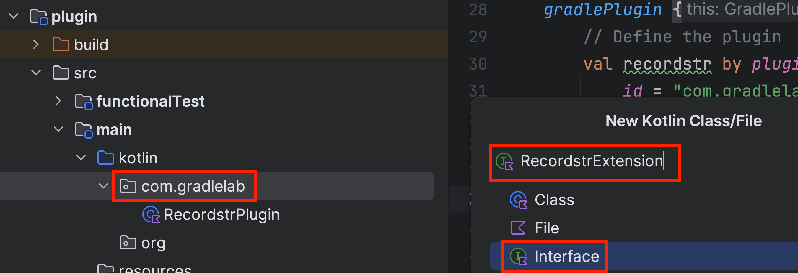

# DPE University Training

<p align="left">

</p>

## Authoring Gradle Plugins - Exercise 2

This is a hands-on exercise to go along with the
[Authoring Gradle Plugins](https://dpeuniversity.gradle.com/app/catalog)
training course. In this exercise you will go over the following:

* Adding an extension to the plugin

---
## Prerequisites

* Finished going through the relevant sections in the training course
* Completed the previous exercise

---
## Scenario

In the hands-on exercises, you will develop a simple "hello world" Gradle
plugin that records a string to a file.

Users can apply the plugin:

```kotlin
plugins {
  id("com.gradlelab.recordstr")
}
```

Then configure it:

```kotlin
recordstr {
  str = "hello world"
  helloFile = layout.buildDirectory.file("hello.txt")
}
```

They can run a task the plugin provides that will record the time:

```kotlin
./gradlew :app:recordstr
```

In this second exercise, you will add the extension so users can configure the plugin.

---
### Create extension interface

Next to `RecordstrPlugin`, create a Kotlin interface called `RecordstrExtension`:



Add variables the following variables:

* `str` - of type Property<String>
* `helloFile` - of type RegularFileProperty

```kotlin
package com.gradlelab

import org.gradle.api.file.RegularFileProperty
import org.gradle.api.provider.Property

interface RecordstrExtension {

  val str : Property<String>

  val helloFile : RegularFileProperty
}
```

---
### Create extension object

Now create an extension object in `RecordstrPlugin` using this interface. Set
default values for the variables:

```kotlin
val extension = project.extensions.create("recordstr", RecordstrExtension::class.java)
extension.str.convention("hello world!")
extension.helloFile.convention(project.layout.buildDirectory.file("hello.txt"))
```

Build the plugin:

```
./gradlew :plugin:build
```

---
### Manually verify extension available

In the `plugin_consumer` project, reload the Gradle configuration in the editor.
Then in the build file, verify you can access the configuration for the plugin
and set values for the variables:

```kotlin
recordstr {
    str = "hello there"
    helloFile = layout.buildDirectory.file("hello_world.txt")
}
```

Refer to the training videos on adding unit tests for the extension.
